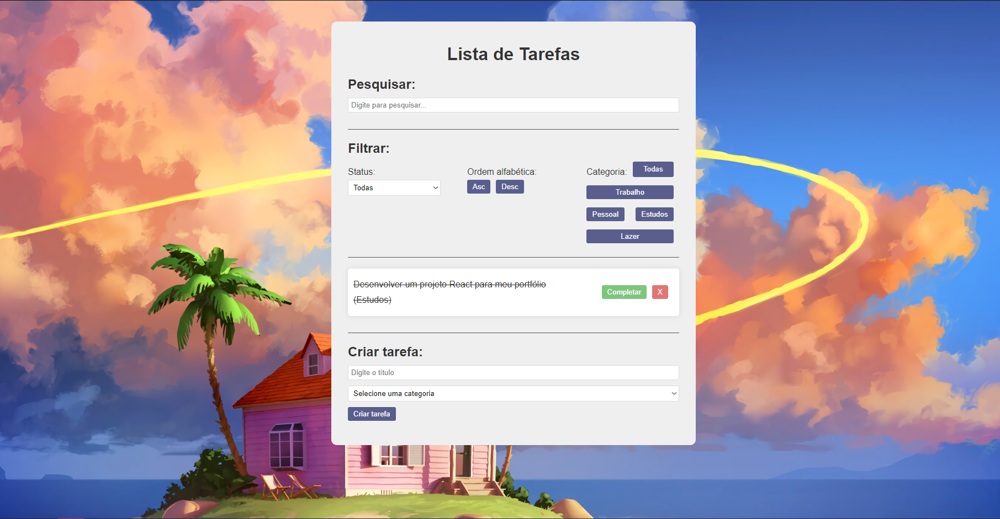

<h1 align="center"> Lista de Tarefas </h1>

Um To Do com React, Vite, CSS e JavaScript.  

  <a href="https://gustavofscode.github.io/lista_de_tarefas_vite_deploy/">Visualize o projeto aqui!</a>&nbsp;&nbsp;&nbsp;|&nbsp;&nbsp;&nbsp;

 

  

## 🚀 Tecnologias

Esse projeto foi desenvolvido com as seguintes tecnologias:

- React
- Vite
- CSS
- JavaScript
- Git e Github

## 💻 Projeto

A Lista de Tarefas é um website que para a criação de tarefas, com cada tarefa tendo seu ID (de forma automática), título e categoria (sendo pré-definidas), podendo ser completada ou excluida, além disso ele possui funcionalidades como de pesquisa e filtragem, com 3 tipos de filtragem, sendo: Status (Completa ou Incompleta), Ordem alfabética (Asc ou Desc) e por Categoria. Para o projeto foi utilizado React como framework, com o próposito de me aprefeiçoar na ferramenta, Vite para facilitar a integração e CSS para a estilização. Foi meu primeiro projeto usando Vite.